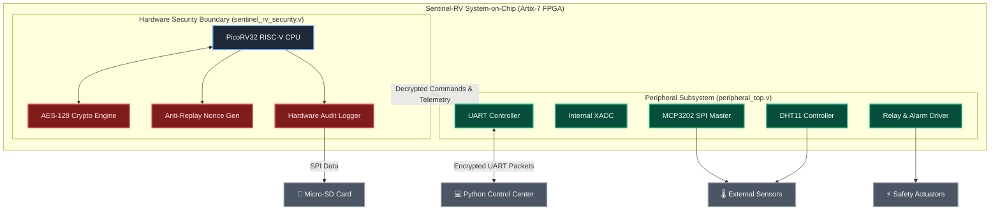

# 🛡️ Sentinel-RV Capstone Project: RISC-V Hardware Security & Telemetry System

Welcome to the **Sentinel-RV Capstone Project** repository. This project implements a secure, FPGA-based System-on-Chip (SoC) powered by an open-source 32-bit RISC-V processor (PicoRV32), hardware-accelerated AES-128 encryption, anti-replay security controllers, multi-sensor telemetry collection and desktop GUI monitoring applications.

> **Why "Sentinel-RV"?**
> *Sentinel* — a guard whose role is to stand watch and protect — reflects the core purpose of this system: enforcing hardware security boundaries, detecting tamper events and protecting actuator access through AES-128 encryption. *RV* refers to the **RISC-V** open-source instruction set architecture powering the embedded PicoRV32 CPU at the heart of the SoC.

---

## 🗂️ System Architecture & Project Structure



### Directory Structure

```
Sentinel_RV_Capstone_Project/
├── Codes/
│   ├── Verilog/                  # Hardware RTL source code, testbenches & Vivado project
│   │   ├── src/                  # Verilog hardware modules (CPU, Security, Sensors, SD Card)
│   │   └── Sentinel_RV-Project/  # Vivado .xpr project file for Artix-7 FPGA target
│   └── Python/                   # Desktop GUI applications
│       ├── App1_FPGA_Control_And_Sensors.py  # Real-time control center & live sensor charts
│       └── App2_SD_Card_Reader.py            # Micro-SD raw physical sector audit log inspector
├── notes/                        # Subsystem design notes and architectural specifications
└── result/                       # Synthesis and Implementation verification reports
```

---

## 🔑 Key Features & Hardware Capabilities

- **32-Bit RISC-V CPU Core (PicoRV32):** Executes embedded firmware instructions to manage memory-mapped I/O peripherals and process security policies.
- **Hardware AES-128 Encryption Engine (`aes128_encrypt.v`):** Encrypts sensor data streams and Micro-SD audit logs in hardware.
- **Anti-Replay Security Controller (`replay_protection.v` & `nonce_generator.v`):** Generates 64-bit dynamic nonces to reject replayed unauthorized commands.
- **Environmental & Intrusion Telemetry:** Interfaced with DHT11 (Temperature & Humidity), MCP3202 (12-bit SPI ADC) and internal Artix-7 XADC (die temperature & voltage rails).
- **SPI Micro-SD Audit Logger (`sd_logger.v`):** Writes encrypted tamper-evident security audit logs directly to physical SD card sectors.
- **Safety Isolation:** Piezo alarm siren and Form-C relay power isolation switch.

---

## 🚀 Getting Started

### 1. Opening the Project in Xilinx Vivado

1. Launch **Xilinx Vivado** (Version 2025.2 or compatible).
2. Open the project file located at:
   ```
   Sentinel_RV_Capstone_Project/Codes/Verilog/Sentinel_RV-Project/Sentinel_RV-Project.xpr
   ```
3. Click **Run Synthesis** then **Run Implementation** to generate the FPGA bitstream for the Artix-7 target (`xc7a35tftg256-1`).

### 2. Running the Python Desktop Application

1. Connect the Artix-7 FPGA board to your PC via USB-UART serial connection.
2. Navigate to `Sentinel_RV_Capstone_Project/Codes/Python/`.
3. Launch the control application:
   ```
   python App1_FPGA_Control_And_Sensors.py
   ```
4. Select the active COM port and baud rate (`115200`) to view live real-time sensor graphs and control the system.

### 3. Reading Micro-SD Audit Logs

1. Run `App2_SD_Card_Reader.py` **as Administrator** (required for raw disk access).
2. Insert the Micro-SD card used by the FPGA into your PC card reader.
3. Select the drive and click **SCAN & DECODE** to read and decrypt the hardware audit log records.
