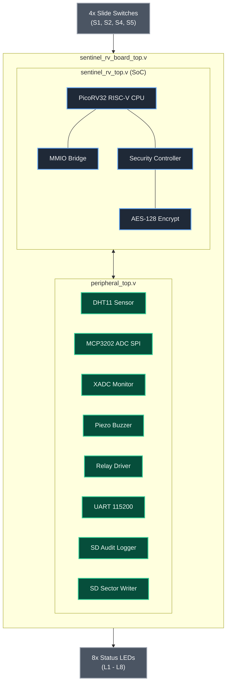

# Sentinel-RV: Comprehensive Architecture Notes & Hardware Specification

## System Design Overview

**Sentinel-RV** is an advanced, high-security 32-bit RISC-V System-on-Chip (SoC) designed for embedded hardware security applications, environmental telemetry monitoring and automated safety enforcement on the **AMD/Xilinx Artix-7 XC7A35T-FTG256-1 FPGA**.

The system integrates an open-source 32-bit RISC-V soft processor core (`PicoRV32`), hardware-accelerated AES-128 encryption, dynamic anti-replay nonce generators, multi-channel sensor telemetry drivers, persistent SPI Micro-SD audit logging and desktop GUI monitoring suites.

---

## Hardware Architecture & System Dataflow

---

## Active Slide Switch & LED Map

| Switch | FPGA Pin | Feature | Function When Switched UP (1) | Status LED |
|--------|----------|---------|-------------------------------|------------|
| S1 | C9 | System Reset | DOWN = Reset held; UP = System Runs | L1 (D5) |
| S2 | B9 | Alarm Clear | Clears latched security alarms and silences buzzer | L2 (A3) |
| S4 | A7 | Alarm Test | Manually sounds 2048 Hz piezo buzzer for hardware test | L4 (A4) |
| S5 | C7 | Relay Force | Manually energizes Form-C Safety Relay ON | L5 (E6) |

---

## LED Status Indicator Map (L1-L8)

| LED | FPGA Pin | Meaning |
|-----|----------|---------|
| L1 | D5 | **System Power / Run** - ON when S1 is UP (system running) |
| L2 | A3 | **SD Card Detected** - ON when Micro-SD card is physically inserted |
| L3 | B4 | **SD Card Activity (RISC-V)** - Blinks during SD card read/write SPI transaction |
| L4 | A4 | **RISC-V CPU Running** - ON when PicoRV32 processor is active (not trapped) |
| L5 | E6 | **Relay Status** - ON when Form-C Safety Relay is energized/closed |
| L6 | C13 | **Security Alarm Active** - ON when tamper/intrusion alarm is triggered |
| L7 | C14 | **Command Accepted** - ON when a valid AES-encrypted command is accepted |
| L8 | D14 | **Command Rejected** - ON when a replayed or invalid command is blocked |

---

## Memory-Mapped I/O (MMIO) Address Space

| Base Address Range | Subsystem / Register | Access | Description |
|--------------------|----------------------|--------|-------------|
| `0x0000_0000 - 0x0000_0FFF` | Internal Block RAM | R/W | 4 KB BRAM executing firmware (`cpu_test_program.hex`) |
| `0x8000_0000` | GPIO Output Register | W | Controls status LEDs, relay state and buzzer enable |
| `0x8000_0004` | GPIO Input Register | R | Reads slide switches S1, S2, S4, S5 |
| `0x8000_0020` | DHT11 Sensor Register | R | Reads 8-bit temperature and 8-bit humidity data |
| `0x8000_0030` | MCP3202 ADC Register | R | Reads 12-bit analog voltage sampling results |
| `0x8000_0040` | UART TX Data Register | W | Transmits byte over 115200 baud serial interface |
| `0x8000_0044` | UART RX Data Register | R | Reads incoming serial command byte |
| `0x8000_0050` | AES Key / Data Register | W | Loads 128-bit key and plaintext into AES-128 hardware cipher |
| `0x8000_0060` | SD Card Command Register | W | Triggers 512-byte sector audit log write |

---

## Security Core & Cryptography Subsystem

### 1. Hardware AES-128 Encryption (`aes128_encrypt.v`)
- Implements a 10-round AES-128 block cipher in pure hardware logic.
- Encrypts 128-bit plaintext blocks into ciphertext in under 12 clock cycles.
- Used for encrypting live serial telemetry frames and SD card audit logs.

### 2. Anti-Replay Protection (`replay_protection.v` & `nonce_generator.v`)
- Generates 64-bit pseudo-random dynamic nonces for every telemetry frame.
- Implements a sliding window sequence number validator to detect and reject replayed or out-of-order unauthorized commands.

### 3. XADC Die Temperature & Power-Rail Monitoring (`xadc_monitor.v`)
- Continuously samples internal FPGA die temperature and VCCINT power rails using Artix-7 internal XADC primitives.
- Triggers automatic security alarms if overheating or voltage tampering is detected.

---

## SPI Micro-SD Card Audit Logging (`sd_logger.v`)

- **Storage Architecture:** Direct SPI mode (`sd_card_init.v`, `spi_sd_master.v`, `sd_sector_writer.v`).
- **Sector Formatting:** Formats security logs into raw 512-byte physical disk sectors.
- **Audit Record Structure:**
  - **Header:** 4-byte signature (`0x53454E54` -> `"SENT"`)
  - **Sequence:** 32-bit monotonically increasing log sequence number.
  - **Sensor Payload:** Encrypted DHT11 temperature, humidity, analog voltage and security flags.
  - **Hash Chain:** 128-bit hash linking the current log entry to the previous block.

---

## Desktop Software Integration

### 1. `App1_FPGA_Control_And_Sensors.py`
- **Real-time Live Sensor Graphing:** Plots live Temperature (degrees C), Humidity (%), and Analog Voltage (V).
- **Security Event Monitor:** Displays live security alerts, command accepted/rejected events and alarm status.
- **Acoustic Burglar Alarm:** Plays alarm siren on intrusion detection events received over UART.

### 2. `App2_SD_Card_Reader.py`
- **Raw Physical Sector Inspection:** Reads physical disk sectors (`\\.\PhysicalDriveX`) from Micro-SD cards formatted by the FPGA.
- **AES Decryption & Audit Trail Verification:** Decrypts 512-byte hardware AES audit log records and verifies sequence numbers.
- **Requires:** Elevated **Windows UAC Administrator** rights to access raw disk sectors.
